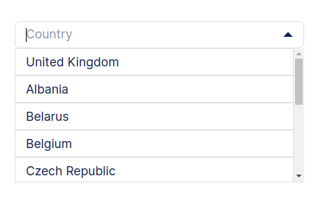

# Custom Select with Search Functionality

This a custom HTML select element with additional search feature.

## Usage
  1. Include the script and CSS
  2. Wrap your `<select>` tag in `<div class="custom-select"></div>`
  3. Add an optional `<input>` to enable search functionality. Make sure you include the class `select-search`
  4. Have in mind that the first `<option>` will be the placeholder for the custom select.


```html
<div class="custom-select">
  <!-- Optional input to search within the options -->
  <input type="text" placeholder="Country" class="select-search">
  <!-- Optional input to search within the options -->
  <select id="country">
    <option value="Country" class="placeholder">Country</option>
    <option value="GB">United Kingdom</option>
    <option value="AL">Albania</option>
    <option value="BY">Belarus</option>
    <option value="BE">Belgium</option>
    <option value="CZ">Czech Republic</option>
    ...
    ...
    ...
  </select>
</div>
```



Alberto Dorta &copy;